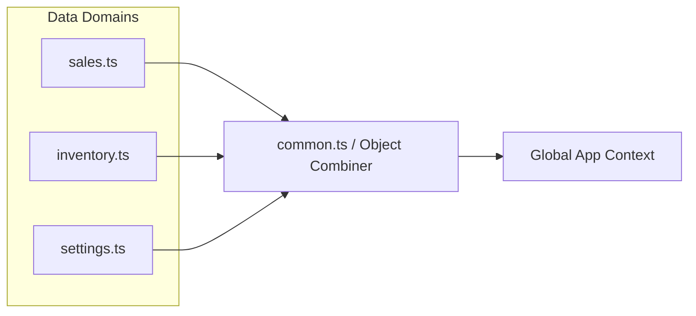

# 📂 Splitting Memory & Plan

This document serves as the central memory and tracking file to record all large files and module chunks needing refactoring.

As outlined in **`AGENTS.md`**, we universally adopt the **Feature-Based / Modular Architecture** method by default. It is the most robust and practical architecture. We only deviate and specify a "Hybrid Model" if the universal method inherently cannot be supported by a specific file (e.g., massive translation or configuration objects instead of UI components).

To ensure AI stability and prevent logic/token limits during code generation, the workload has been divided into highly granular, manageable phases.

---

## 🏗️ Phase-Wise Splitting Plan

### Phase 1: Settings Hub (Universal Feature-Based)
The primary entry point for settings.
| File Path | Splitting Method | Action Plan | Status |
| :--- | :--- | :--- | :--- |
| `src/components/Settings/SettingsView.tsx` | Feature-Based | Extract tabs to `views/`, logic to `hooks/`, types to `types.ts`. | 🟢 **COMPLETED** |

### Phase 2: Settings Heavy Sub-Views (Universal Feature-Based)
Additional large setup pages from the settings domain.
| File Path | Splitting Method | Action Plan | Status |
| :--- | :--- | :--- | :--- |
| `src/components/Settings/FirmSettings.tsx` | Feature-Based | Divide setting cards and options into `views/`. | 🟢 **COMPLETED** |
| `src/components/Settings/InvoicePrintSettings/index.tsx` | Feature-Based | Inner tabs should be shifted to internal `views/` with isolated states. | 🟢 **COMPLETED** |

### Phase 3: Core Masters & Import UI (Universal Feature-Based)
Extremely large interface components.
| File Path | Splitting Method | Action Plan | Status |
| :--- | :--- | :--- | :--- |
| `src/components/Masters/ItemMaster/Tabs/ItemsTab/views/ItemModal.tsx` | Feature-Based | Slice form segments into separate step views. | 🟢 **COMPLETED** |
| `src/components/Operations/Import/step1/SubStepChoose.tsx` | Feature-Based | Abstract handlers to `hooks/`, purely render data in `views/`. | 🟢 **COMPLETED** |

### Phase 4: Core Voucher Logic Hooks A (Universal Feature-Based)
First batch of massive hooks inside entries.
| File Path | Splitting Method | Action Plan | Status |
| :--- | :--- | :--- | :--- |
| `vouchers/ReceiptVoucher/hooks/useReceiptVoucherLogic.tsx` | Feature-Based | Split massive logic hook into smaller domain hooks under feature. | 🟢 **COMPLETED** |
| `vouchers/PaymentVoucher/hooks/usePaymentVoucherLogic.tsx` | Feature-Based | Break down into smaller atomic hooks in its `hooks/` folder. | 🟢 **COMPLETED** |

### Phase 5: Core Voucher Logic Hooks B (Universal Feature-Based)
Second batch of massive hooks inside entries.
| File Path | Splitting Method | Action Plan | Status |
| :--- | :--- | :--- | :--- |
| `vouchers/ContraVoucher/hooks/useContraVoucherLogic.tsx` | Feature-Based | Break down into smaller atomic hooks in its `hooks/` folder. | 🟢 **COMPLETED** |
| `vouchers/JournalVoucher/hooks/useJournalVoucherLogic.tsx` | Feature-Based | Break down into smaller atomic hooks in its `hooks/` folder. | 🟢 **COMPLETED** |

### Phase 6: Trading Voucher Logic Hooks C (Universal Feature-Based)
Third batch of massive hooks inside entries.
| File Path | Splitting Method | Action Plan | Status |
| :--- | :--- | :--- | :--- |
| `vouchers/SalesVoucher/hooks/useSalesVoucherLogic.tsx` | Feature-Based | Break down into smaller atomic hooks in its `hooks/` folder. | 🟢 **COMPLETED** |
| `vouchers/PurchaseVoucher/hooks/usePurchaseVoucherLogic.tsx` | Feature-Based | Break down into smaller atomic hooks in its `hooks/` folder. | 🟢 **COMPLETED** |

### Phase 7: Adjustment & Preview Sub-Views (Universal Feature-Based)
Final batch of voucher logic/components.
| File Path | Splitting Method | Action Plan | Status |
| :--- | :--- | :--- | :--- |
| `vouchers/CreditNoteVoucher/hooks/useCreditNoteVoucherLogic.tsx` | Feature-Based | Break down into smaller atomic hooks in its `hooks/` folder. | 🟢 **COMPLETED** |
| `vouchers/DebitNoteVoucher/hooks/useDebitNoteVoucherLogic.tsx` | Feature-Based | Break down into smaller atomic hooks in its `hooks/` folder. | 🟢 **COMPLETED** |
| `src/components/Operations/VoucherEntry/VoucherPreview.tsx` | Feature-Based | Break down preview UI into `views/`, routing logic to `hooks/`. | 🟢 **COMPLETED** |

### Phase 8: Data Translation Segregation (Hybrid Data Segregation)
Files in this phase DO NOT support the universal Feature-Based architecture (as they are not UI components/features, but rather massive data objects or pure function files).
| File Path | Splitting Method | Action Plan | Status |
| :--- | :--- | :--- | :--- |
| `src/context/translations/hi/common.ts` | Hybrid | Slice translation data into domain-specific objects (`hi/sales.ts`, etc.) and merge them back at export. | 🟢 **COMPLETED** |

---

## 📐 Architecture & Flow Diagrams

### 1. Primary Feature-Based Architecture (Universal Method)
This flows explicitly from the core `AGENTS.md` guidelines. UI modules act as wrappers, linking segmented logic, types, and presentation layers.

```mermaid
graph TD
    A[Global Domain/Context] --> F[Feature Interface Module]
    F --> I[index.tsx (Main Wrapper)]
    F --> T[types.ts (Interfaces specific to feature)]
    F --> H[hooks/ (State & Actions)]
    F --> V[views/ (Render Nodes)]
    H --> H1[useLogicA.ts]
    H --> H2[useLogicB.ts]
    V --> V1[SubViewComponentA.tsx]
    V --> V2[SubViewComponentB.tsx]
```

#### Universal Folder Structure Strategy
Here is the strict folder structure standard applied across Phase 1 target files, adhering identically to the rule in `AGENTS.md`.

```text
src/components/YourFeatureName/
 ├── 📄 index.tsx                   (Main Wrapper: Combines views and logic)
 ├── 📄 types.ts                    (Feature Scope Types: Props, State, Enums)
 │
 ├── 📁 hooks/                      (Logic & State Management)
 │    ├── 📄 useTelemetry.ts        (Telemetry hook logic)
 │    ├── 📄 useFetchData.ts        (API query handlers)
 │    └── 📄 useFormActions.ts      (Event handlers for form submission)
 │
 └── 📁 views/                      (Dumb/Smart UI Segments)
      ├── 📄 SectionHeader.tsx      (Header Component)
      ├── 📄 DataGrid.tsx           (Tabular Data Presentation)
      ├── 📄 SettingsModal.tsx      (Modal Form Sub-view)
      └── 📄 EventListeners.tsx     (Background listener UI Wrappers)
```

### 2. Hybrid Data Segregation Architecture (Phase 8 Method)
Used strictly for data chunks or enormous object literals that cannot be structured into React `hooks/` or `views/`.



#### Hybrid Folder Structure Strategy
```text
src/context/translations/hi/
 ├── 📄 common.ts                   (Combiner & Exporter of all blocks)
 │
 ├── 📁 domains/                    (Sub-divided pure data blocks)
 │    ├── 📄 sales.ts               (Sales translations)
 │    ├── 📄 inventory.ts           (Inventory translations)
 │    ├── 📄 ui.ts                  (Core UI/Nav translations)
```
