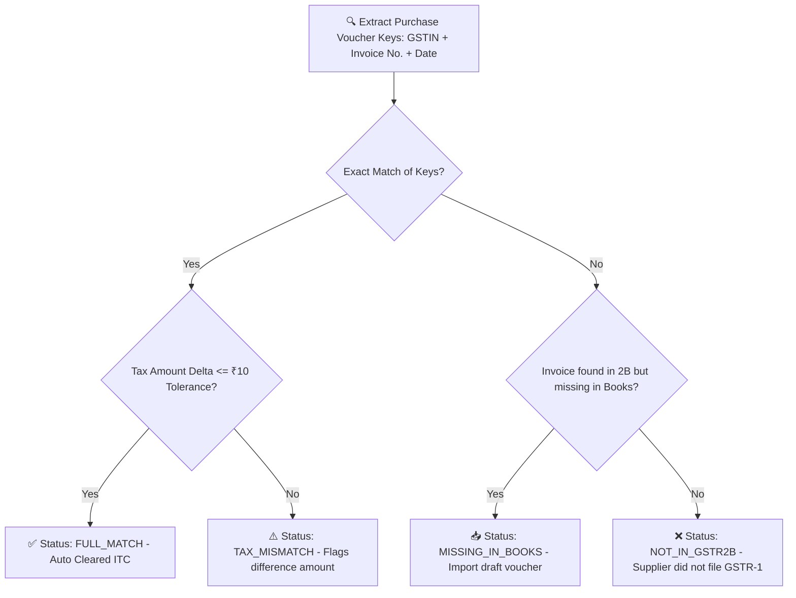

# GSTR-1 & AutoMatch Implementation Guide: From Demo to Real Working Stage 🚀
*(जीएसटीआर-1 और ऑटोमैच गाइड: डेमो मोड से रियल वर्किंग स्टेज तक का सफर)*

यह मार्गदर्शिका दो मुख्य डिवीजनों (डबल विंग्स) में विभाजित है:
1. **Division One: Human Setup, Configuration & Manual Intervention** (वह कार्य जो केवल मनुष्य/ऑपरेटर द्वारा किए जाने हैं)।
2. **Division Two: Automated AI Ingestion, Code & System Execution** (वह कार्य जो एआई मॉडल्स और सिस्टम सॉफ्टवेयर द्वारा स्वचालित रूप से बिना मानवीय हस्तक्षेप के पूरे किए जाएंगे)।

---

# ⚓ DIVISION ONE: HUMAN SETUP, CONFIGURATION & MANUAL INTERVENTION
*(डिवीजन 1: मानव सेटअप, पर्यावरण कॉन्फ़िगरेशन और मानवीय क्रियाएं)*

इस सेक्शन के सभी कदम केवल एक मानव ऑपरेटर, सिस्टम एडमिनिस्ट्रेटर या टैक्स अधिकारी द्वारा ही किए जा सकते हैं। एआई या सॉफ्टवेयर इसे स्वतः शुरू नहीं कर सकता।

## 1. GSP (GST Suvidha Provider) License Procurement
सरकारी नियमों के अनुसार, कोई भी निजी ऐप सीधे भारतीय जीएसटीएन (GSTN) नेटवर्क पर डेटा नहीं भेज सकता। मनुष्यों को निम्नलिखित कार्य करने होंगे:
* **GSP साइनअप:** [ClearTax Developer Portal](https://developers.cleartax.in/), [MastersIndia](https://www.mastersindia.co/) या [Adaequare](http://www.adaequare.com/) जैसे अधिकृत प्रोवाइडर के साथ पार्टनरशिप करें।
* **API क्रेडेंशियल्स टोकन:** उनके पोर्टल से `Client_ID` और `Client_Secret` प्राप्त करें।

## 2. Server-Side Environment Code Secrets Setup
प्राप्त क्रेडेंशियल्स को सुरक्षित सर्वर फाइलों में मानव डेवलपर द्वारा निम्नलिखित रूप से दर्ज किया जाना चाहिए:
* `.env` या `.env.production` फ़ाइल में क्रेडेंशियल्स जोड़ें:
  ```env
  GST_GSP_CLIENT_ID=your_human_provided_client_id
  GST_GSP_CLIENT_SECRET=your_human_provided_secret
  GST_GSP_BASE_URL=https://production.gspapi.co.in/gst/v1
  ```

## 3. GST Portal API Access Activation
जीएसटीएन सरकारी पोर्टल पर जाकर एपीआई कनेक्टिविटी को चालू करना:
* **Government Portal Login:** मानव कॉर्पोरेट अधिकारी को [gst.gov.in](https://www.gst.gov.in/) पर लॉगिन करना होगा।
* **Enable API Access:** "My Profile" > "Manage API Access" पर जाएं।
* **Confirm 'Yes':** एपीआई सत्र की सीमा का चयन करें (जैसे 6 घंटे या 30 दिन) और पहुँच चालू करें।

## 4. Submission OTP Authentication (EVC / DSC Consent)
लायबिलिटी फ़ाइल या अपलोड करने के समय वास्तविक सुरक्षा सहमति देना:
* **EVC / OTP Entry:** जब एप्लिकेशन सरकार को अंतिम पेलोड भेजता है, तो मानव को रजिस्टर्ड मोबाइल नंबर पर प्राप्त ओटीपी (One-Time Password) को स्क्रीन पर देखकर दर्ज करना होगा।
* **DSC Dongle Plug-In:** यदि डिजिटल हस्ताक्षर का उपयोग किया जा रहा है, तो कॉर्पोरेट सेक्रेटरी को भौतिक यूएसबी डॉन्गल (USB DSC) अपने सिस्टम में लगाना होगा।

## 5. Non-Compliant Vendor Decision-Making
रिकॉन्सिलिएशन रिपोर्ट आने के बाद मैनुअल व्यापारिक निर्णय लेना:
* **Supplier Follow-up:** उन वेंडर्स से फोन, ईमेल या व्यक्तिगत रूप से संपर्क करना जिन्होंने अपना जीएसटीआर-1 नहीं भरा है जिससे आपका इनपुट क्रेडिट (ITC) रुका हुआ है।
* **Hold Payments:** गड़बड़ी पाए जाने पर वेंडर के कर हिस्से का भुगतान रोकना।

---

# 🤖 DIVISION TWO: AUTOMATED AI INGESTION & SYSTEM MODEL EXECUTION
*(डिवीजन 2: स्वचालित एआई विंग, सिस्टम कार्यान्वयन और सॉफ्टवेयर प्रोसेसिंग)*

इस सेक्शन के सभी कदम पूरी तरह स्व-चालित हैं। इसे एआई कोडिंग एजेंट, क्रॉन जॉब्स और डेटा प्रोसेसिंग पाइपलाइन्स द्वारा बिना किसी मानव हस्तक्षेप के पर्दे के पीछे संचालित किया जाता है।

## 1. Smart Voucher Ingestion & Auto-Alignment
* **AI Parser:** उपयोगकर्ताओं द्वारा अपलोड किए गए कच्चे एक्सेल शीट्स, पीडीएफ (PDF), या इनवॉइस इमेज को एआई विज़न और पार्सिंग इंजन द्वारा स्कैन किया जाता है।
* **Schema Alignment:** एआई असंगत इनवॉइस फोर्मेट्स का मिलान करके उन्हें स्टैंडर्ड हेडर फ़ील्ड्स में ढालता है।

## 2. String & Invoice Number Normalization
मानव आपूर्तिकर्ता अक्सर इनवॉइस नंबर अलग-अलग शैली में रिकॉर्ड करते हैं। सॉफ्टवेयर एल्गोरिथ्म निम्नलिखित नियमों के अनुसार इनवॉइस नंबरों को स्वचालित रूप से सुव्यवस्थित करता है:
```typescript
export function normalizeInvoiceNumber(invNum: string): string {
  // विशेष अक्षरों जैसे /, -, और स्पेस को हटाना तथा अग्रणी शून्यों (leading zeros) को साफ़ करना
  return invNum
    .replace(/[\/\-\s]/g, '')
    .replace(/^0+/, '')
    .toUpperCase();
}
```

## 3. Auto-Match Reconciliation Algorithm
जब **"Run AutoMatch Audit"** बटन दबाया जाता है, तो प्रोग्राम सेकंडों में हजारों इनवॉइस का विश्लेषण करता है:


### Dynamic Tolerance Checker (सहिष्णुता सीमा):
गणितीय या राउंडिंग ऑफ भिन्नताओं को स्वीकार करना:
```typescript
const TAX_TOLERANCE_INR = 10.0; // ₹10.00 का राउंडिंग टॉलरेंस सरकारी नियमानुसार स्वीकार्य

export function reconcileTaxes(booksTax: number, portalTax: number): boolean {
  return Math.abs(booksTax - portalTax) <= TAX_TOLERANCE_INR;
}
```

## 4. Government Compliant GSTR-1 JSON Payload Generation
आंतरिक डेटा बेस के रिकॉर्ड्स को सटीक सरकारी पेलोड प्रारूप में बदलना। सिस्टम स्वतः निम्नलिखित संरचना में JSON का निर्माण करता है:
```json
{
  "gstin": "27AAAFB6318C1Z4",
  "fp": "062026",
  "b2b": [
    {
      "ctin": "27BCCCD1212A1Z1",
      "inv": [
        {
          "inum": "INV202611",
          "idt": "05-06-2026",
          "val": 118000.00,
          "pos": "27",
          "rchrg": "N",
          "inv_typ": "R",
          "itms": [
            {
              "num": 1,
              "itm_det": {
                "rt": 18.00,
                "txval": 100000.00,
                "camt": 9000.00,
                "samt": 9000.00,
                "iamt": 0.00,
                "csamt": 0.00
              }
            }
          ]
        }
      ]
    }
  ]
}
```

## 5. Network Handshakes, API Failures & Queues
* **Token Expire Handling:** यदि सरकारी टोकन एक्सपायर हो जाता है, तो सर्वर `401 Unauthorized` प्रतिक्रिया मिलने पर नई रीफ्रेश रिक्वेस्ट भेजकर सत्र को पुनर्जीवित करता है।
* **Retry Queue Engine:** यदि सरकारी पोर्टल्स धीमे हैं (`503 Service Unavailable`), तो सिस्टम बैकग्राउंड क्यू में डालकर पुनः प्रयास के लिए शेड्यूलिंग को नियंत्रित करता है:
  ```typescript
  if (response.status === 503) {
    scheduleNextRetryInMinutes(5); // 5 मिनट बाद स्वतः पुन: प्रयास
  }
  ```

---
*(This document is split to guide AI developers and human administrators cleanly and is fully retained within the workspace)*
